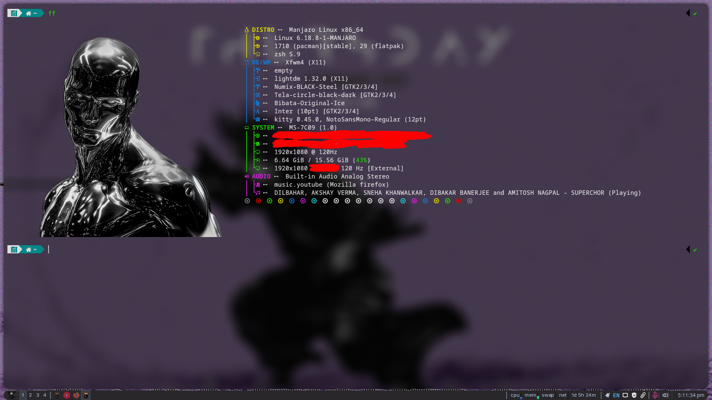
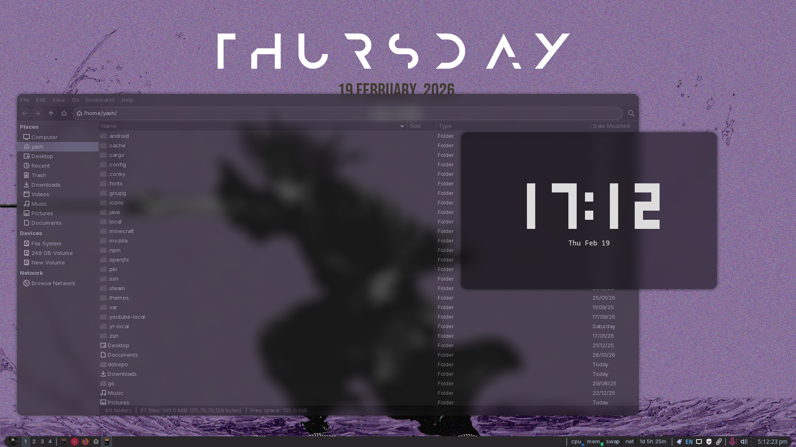

# My Minimalist X11 Rice

### TRIED AND TESTED WITH XFCE 4.20 ON MANJARO 

This "rice" consists of:-

- Conky for the "Mond" style widget in the desktop, 
- Glava for audio visualizer at the desktop
- Picom-ft-labs for transparency, blur, and animations
- Kitty terminal
- Fastfetch for system info fetch

### Screenshots (look at it before applying, dont apply if its not your thing)

  
  

## The Setup
* **Terminal:** [Kitty](https://sw.kovidgoyal.net/kitty/)
* **Fetch:** [Fastfetch](https://github.com/fastfetch-cli/fastfetch)
* **Compositor:** [Picom-ftlabs](https://github.com/ftlabs/picom) (for animations and blur like my screenshots)
* **Widget:** [Conky](https://github.com/brndnmtthws/conky) 
* **Audio Visualizer:** [GLava](https://github.com/jarcode-foss/glava)

---

## Prerequisites & Installation

### 1. Fonts
You will need these installed for the widgets and terminal to render correctly:
- **Anurati** & **BebasNeue** (For the Conky Mond Widget)
- **Hack Nerd Font** (For Kitty and Fastfetch icons)

### 2. Apps
| Tool | Note |
| :--- | :--- |
| **Picom-ftlabs** | Build this from source (`picom-ftlabs-git`) for the specific blur/animations. |
| **Conky** | For the desktop clock/widget. |
| **GLava** | Audio visualizer. |
| **Fastfetch** |  |

---

## Credits & Inspiration
* **Conky Widget:** Inspired by [VipinVIP](https://github.com/VipinVIP/my-conky)
* **Kitty Config:** Based on [stefan-hacks/ikitty](https://github.com/stefan-hacks/ikitty) but modified a lot.
* **Fastfetch Layout:** Adapted from this [comment](https://github.com/fastfetch-cli/fastfetch/discussions/971#discussioncomment-11923435)

---

## Disclaimer
> [!WARNING]  
> This is a personal configuration. **Review the scripts before applying them.** I am not responsible if your system breaks. Dont complain to me, im a begginer too.
